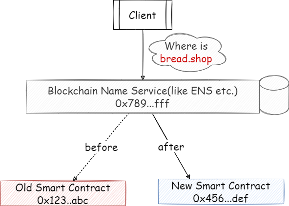

# solidity-upgrade-compatible
solve the problem that ethereum solidity smart contract NOT upgrade compatible

## WE KNOW THAT...

Once your smart contract code has deployed on ETHEREUM chain, then it cannot be changed by all means.This feature, on the one hand, makes "CODE IS LAW", on the other hand, may lead to horrible disaster when the code has bugs.Since the United States constitution is changing all the time, no one could assure that the code is forever perfect.

## SO WE WANT TO...

Upgrade the code to provide new features or fix bugs, this is very common in software deployment.

When we deal with traditional computer programm: we give our client a IP:PORT, so we just need to shutdown old version - release the IP:PORT - deploy new version - make new version listen on the IP:PORT.

But we know that smart contract is very different, we give our client an address, but the address is bind to our code the time we deploy it, no way to change or delete.

## 

## WAY1: SIMPLEST

